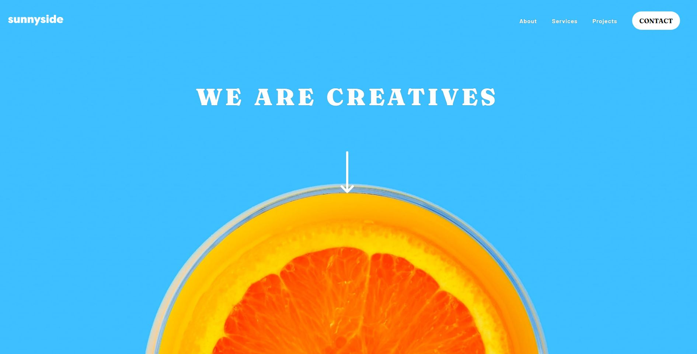

# Frontend Mentor - Sunnyside agency landing page solution

This is a solution to the [Sunnyside agency landing page challenge on Frontend Mentor](https://www.frontendmentor.io/challenges/sunnyside-agency-landing-page-7yVs3B6ef). Frontend Mentor challenges help you improve your coding skills by building realistic projects.

## Table of contents

- [Overview](#overview)
  - [The challenge](#the-challenge)
  - [Screenshot](#screenshot)
  - [Links](#links)
- [My process](#my-process)
  - [Built with](#built-with)
  - [What I learned](#what-i-learned)
  - [Continued development](#continued-development)
  - [Useful resources](#useful-resources)
- [Author](#author)
- [Acknowledgments](#acknowledgments)

## Overview

### The challenge

Users should be able to:

- View the optimal layout for the site depending on their device's screen size
- See hover states for all interactive elements on the page

### Screenshot




### Links

- Live Site URL: [SunnySide-LandingPage](https://sunnyside-landingpage-hector.netlify.app/)

## My process

### Built with

- Semantic HTML5 markup
- CSS custom properties
- Flexbox
- CSS Grid
- Mobile-first workflow
- SCSS

### What I learned

I learned alot this project. I wrote alot of redundant code that could of been reduced if I implemented the mobile design first. I also tried this project with Sass. I noticed a great benefit to using Sass. The mixins made life easier. After deploying my code to a server, I realized that I forgot to accomodate my code for all web browsers. For example, in Safari the icons for external websites like Twitter do not work. These are few examples of what I learned. 

```html
<header>
    <nav>
      <div class='navSection'>
        <div class='navHeader' >
          <a href='#'></a>
          <button class='toggleBtn'></button>
        </div>
        <ul class='links'>
          <li><a href=#About>About</a></li>
          <li><a href=#Services>Services</a></li> 
          <li><a href=#Projects>Projects</a></li> 
           <li><button class='contactBtn btn'>CONTACT</button></li>
        </ul>
      </div>
    </nav>
```
I practiced Semantic HTML as seen above. 

```SCSS
@mixin formatBottomLinks($bodyHeight, $logoHeight, 
                        $bottomAWidth, $bottomBWidth){
    display:flex;
         justify-content: center;
         align-items: center;
         flex-direction: column;
         height:$bodyHeight;
         background-color: #90D4C5;
         .bottomLogo{
             fill: $primary-moderate-cyan;
             height: $logoHeight;
         }
         .bottomA{
             list-style-type: none;
             width: $bottomAWidth;
             display: flex;
             align-items: center;
             justify-content: space-between;
             padding: 2rem;
             a{
                 display: block;  
                 text-decoration: none;
                 color: $primary-moderate-cyan;
                 font-family: $barlow-font;
                 font-size: 1rem;
             }
         }
         .bottomB{
            list-style-type: none;
            width: $bottomBWidth;
            display: flex;
            align-items: center;
            justify-content: space-between;
            padding: 2rem;
            a{
                display: block;  
                text-decoration: none;
                color: $primary-moderate-cyan;
                font-family: $barlow-font;
                font-size: 1rem;
            }
         }
}
```

The mixin above was used to formot bottom links. 

```js
toggleBtn.addEventListener('click', ()=>{
    if(links.classList.contains('show-links')){
        links.classList.remove('show-links');
    }
    else{
        links.classList.add('show-links');
    }
});
```

Simple javascript to toggle menu. There were two ways of toggling the menu. One way was manually like the code above or by using the .toggle() method.

### Continued development

I plan on working on more Front End developer projects. I want to get stronger as Javascript and eventually try REACT. 

### Useful resources

- [Sass Resource](https://sass-lang.com/guide) - This Sass resourse helped me implement Sass into this project.
- [Viewport Units Resource](https://www.sitepoint.com/css-viewport-units-quick-start/) - This helped me get better at using viewport units to size objects.

## Author

- Frontend Mentor - [@hdelgad3](https://www.frontendmentor.io/profile/hdelgad3)
- Twitter - [@Irllydo](https://twitter.com/Irllydo)


## Acknowledgments

I'd like to acknowledge StackOverFlow for helping me make a div corner sharper. 

